 # Software Requirements Specification & UML Diagrams
## Kaizen HackXplore - AI-Driven College ERP System

---

## 📋 Executive Summary

**Kaizen HackXplore** is an intelligent College Enterprise Resource Planning (ERP) system that leverages AI, machine learning, and modern web technologies to revolutionize academic management and learning experiences. The system automates workflow processes, provides AI-powered assessments, enables collaborative learning, and delivers personalized learning recommendations.

### **System Overview**
- **Three-Tier Architecture**: React Frontend (port 5173) → Express.js Backend (port 4000) → Flask AI Service (port 5000)
- **Database**: MongoDB for persistence, ChromaDB for vector embeddings
- **APIs**: YouTube API for video recommendations, Google Generative AI (Gemini) for content generation
- **Authentication**: JWT-based token system with role-based access control

---

## 📊 PART 1: CODEBASE STRUCTURE & FUNCTIONAL REQUIREMENTS

### **1.1 System Architecture Overview**

The system is composed of three primary layers:

#### **Layer 1: Frontend (React + Vite)**
- **Location**: `frontend/src`
- **Key Components**:
  - Course/Assignment Management Pages
  - Student Dashboard & Performance Analytics
  - Interactive Quiz & Viva Interfaces
  - Real-time Collaboration on Projects
  - Personalized Learning Recommendations
  - 3D Avatar Integration for Learning Support

#### **Layer 2: Backend (Node.js/Express)**
- **Location**: `backend/`
- **Database**: MongoDB (Mongoose ODM)
- **Core Responsibilities**:
  - User authentication & authorization
  - CRUD operations for all academic entities
  - Assignment submission & result storage
  - Real-time communication (Socket.io)
  - Integration with AI services

#### **Layer 3: AI Service (Python/Flask)**
- **Location**: `flask/`
- **Key Functions**:
  - PDF processing (OCR, text extraction)
  - Automated assignment evaluation using RAG
  - AI-powered assessment generation
  - Course recommendation engine
  - Topic extraction & semantic analysis
  - YouTube video search integration

### **1.2 Data Models**

#### **Core Entities**
1. **User** - Teacher/Student roles
2. **Class** - Classroom/Course container
3. **Assignment** - Homework with submissions & feedback
4. **Quiz** - Automated assessments with results
5. **Viva** - Oral examination with AI voice integration
6. **Lecture** - Multimedia content delivery
7. **Post** - Discussion forum posts
8. **Project** - Collaborative project workspace
9. **TimeTable** - Scheduled events/classes
10. **Comment** - Threaded discussions on lectures

### **1.3 Key Features by Actor**

#### **For Teachers**
✅ Create/manage public and private classes  
✅ Upload assignments with chapter references  
✅ Auto-generate quizzes from PDFs  
✅ AI-powered viva assessments with voice cloning  
✅ View student analytics and performance dashboards  
✅ Generate automated timetables  
✅ Collaborate on projects with students  
✅ Publish multimedia lectures

#### **For Students**
✅ Join classes using unique class codes  
✅ Submit assignments with plagiarism detection  
✅ Receive AI-generated feedback on submissions  
✅ Take auto-generated quizzes & vivas  
✅ Access personalized course recommendations  
✅ View performance analytics & progress tracking  
✅ Collaborate in real-time on projects  
✅ Participate in discussion forums

#### **System-Level Features**
✅ Role-based access control (RBAC)  
✅ JWT authentication  
✅ Real-time notifications via WebSocket  
✅ Automatic timetable generation (Genetic Algorithm)  
✅ AI-powered assessment with RAG  
✅ Vector database for semantic search  
✅ Plagiarism detection  
✅ Voice-cloned AI tutoring bot

---

## 🎬 PART 2: UML DIAGRAMS

### **2.1 USE CASE DIAGRAM**

This diagram shows all actors (Teachers, Students, Admin) and their interactions with the system.

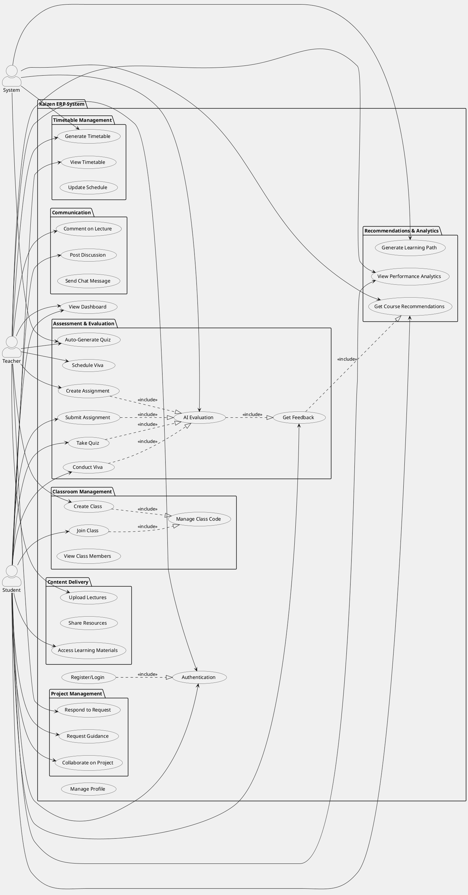

---

### **2.2 CLASS DIAGRAM**

This diagram shows all data models, attributes, relationships, and multiplicities.

```plantuml
@startuml ClassDiagram_Kaizen
skinparam backgroundColor #f0f0f0
skinparam classBackgroundColor #e1f5ff
skinparam classBorderColor #0277bd

class User {
    - _id: ObjectId
    - name: String
    - email: String
    - password: String
    - role: Enum["teacher", "student"]
    - profile_pic: String
    - createdAt: DateTime
    - updatedAt: DateTime
    --
    + register(): Boolean
    + login(): Token
    + updateProfile(): Boolean
    + getRole(): String
}

class Class {
    - _id: ObjectId
    - name: String
    - description: String
    - subject: String
    - classCode: String
    - isPublic: Boolean
    - teacher: ObjectId[User]
    - students: ObjectId[User][]
    - createdAt: DateTime
    --
    + generateClassCode(): String
    + joinClass(student): Boolean
    + removeStudent(student): Boolean
    + getMembers(): User[]
}

class Assignment {
    - _id: ObjectId
    - title: String
    - description: String
    - classId: String
    - chapterPdf: String
    - assignmentPdf: String
    - deadline: DateTime
    - submissions: Submission[]
    - createdAt: DateTime
    - updatedAt: DateTime
    --
    + createAssignment(): Boolean
    + submitAnswer(submission): Boolean
    + evaluateSubmission(): Feedback
    + getSubmissions(): Submission[]
}

class Submission {
    - _id: ObjectId
    - studentId: ObjectId[User]
    - answerFile: String
    - plagiarismScore: Number
    - isConfirmed: Boolean
    - submittedAt: DateTime
    - result: Object
    - feedback: Feedback[]
    - feedbackGeneratedAt: DateTime
    --
    + calculateScore(): Number
    + generateFeedback(): Feedback
    + checkPlagiarism(): Number
}

class Feedback {
    - question: String
    - context: String
    - answer: String
    - evaluation: String
    - feedback: String
    - score: Number
    - max_score: Number
    - question_no: Number
    --
    + generateAIFeedback(): String
    + calculateScore(): Number
}

class Quiz {
    - _id: ObjectId
    - classid: String
    - quizname: String
    - startTime: DateTime
    - duration: Number
    - duedate: DateTime
    - markperquestion: Number
    - questionAnswerSet: Question[]
    - createdAt: DateTime
    --
    + createQuiz(): Boolean
    + generateQuestionsFromPDF(): Question[]
    + submitQuiz(response): QuizResult
}

class Question {
    - questionText: String
    - options: String[]
    - correctoption: String
    --
    + validate(): Boolean
}

class QuizResult {
    - _id: ObjectId
    - quizid: ObjectId[Quiz]
    - studentId: ObjectId[User]
    - studentName: String
    - totalQuestions: Number
    - questionAnswerSet: QuestionAnswer[]
    - overallMark: Number
    - dateofquiz: DateTime
    - proctoredFeedback: ProctoredFeedback
    --
    + calculateScore(): Number
    + generateReport(): String
}

class ProctoredFeedback {
    - phoneDetectedCount: Number
    - laptopDetectedCount: Number
    - bookDetectedCount: Number
    - multipleUsersDetectedCount: Number
    - tabSwitchingDetectedCount: Number
    --
    + flagAnomalies(): Boolean
}

class Viva {
    - _id: ObjectId
    - classid: String
    - vivaname: String
    - timeofthinking: Number
    - numberOfQuestionsToAsk: Number
    - duedate: DateTime
    - status: Boolean
    - questionAnswerSet: VQuestion[]
    - createdAt: DateTime
    --
    + createViva(): Boolean
    + generateVoiceClonedQuestions(): String[]
    + conductViva(): VivaResult
}

class VQuestion {
    - questionText: String
    - answer: String
    --
    + generateVoiceClone(): Audio
}

class VivaResult {
    - _id: ObjectId
    - vivaid: ObjectId[Viva]
    - studentId: ObjectId[User]
    - studentName: String
    - responses: String[]
    - score: Number
    - dateofviva: DateTime
    --
    + calculateScore(): Number
    + evaluateResponse(answer): Number
}

class Lecture {
    - _id: ObjectId
    - classId: ObjectId[Class]
    - teacherId: ObjectId[User]
    - title: String
    - description: String
    - youtubeLink: String
    - videoPath: String
    - createdAt: DateTime
    --
    + uploadLecture(): Boolean
    + getComments(): Comment[]
    + deleteComment(commentId): Boolean
}

class Comment {
    - _id: ObjectId
    - lectureId: ObjectId[Lecture]
    - userId: ObjectId[User]
    - text: String
    - createdAt: DateTime
    --
    + createComment(): Boolean
    + deleteComment(): Boolean
}

class Post {
    - _id: ObjectId
    - user: ObjectId[User]
    - classId: ObjectId[Class]
    - description: String
    - image: String
    - likes: ObjectId[User][]
    - comments: PostComment[]
    - createdAt: DateTime
    --
    + createPost(): Boolean
    + likePost(user): Boolean
    + unlikePost(user): Boolean
    + addComment(comment): Boolean
}

class PostComment {
    - user: ObjectId[User]
    - text: String
    - createdAt: DateTime
    --
    + deleteComment(): Boolean
}

class Project {
    - _id: ObjectId
    - title: String
    - description: String
    - teacher: ObjectId[User]
    - student: ObjectId[User]
    - status: Enum["requested", "accepted", "rejected", "completed"]
    - googleDocId: String
    - studentRequest: String
    - teacherResponse: String
    - githubRepo: String
    - createdAt: DateTime
    --
    + requestGuidance(): Boolean
    + respondToRequest(): Boolean
    + updateStatus(): Boolean
    + shareDocument(): Boolean
}

class Timetable {
    - _id: ObjectId
    - userId: ObjectId[User]
    - schedule: ScheduleItem[]
    - createdAt: DateTime
    --
    + generateTimetable(): Boolean
    + updateSchedule(): Boolean
    + getScheduleForDate(date): ScheduleItem[]
}

class ScheduleItem {
    - date: String
    - day: String
    - hours: Number
    - topic: String
    --
    + validate(): Boolean
}

class Resource {
    - _id: ObjectId
    - title: String
    - description: String
    - url: String
    - type: String
    - topicArea: String
    --
    + generateRecommendation(): Resource
}

' Relationships
User "1" --> "0..*" Class: teaches/enrolls
Class "1" --> "0..*" Assignment: contains
Assignment "1" --> "0..*" Submission: has
Submission "1" --> "0..*" Feedback: generates
Quiz "1" --> "0..*" Question: contains
Quiz "1" --> "0..*" QuizResult: produces
QuizResult "1" --> "0..*" ProctoredFeedback: includes
Viva "1" --> "0..*" VQuestion: contains
Viva "1" --> "0..*" VivaResult: produces
Lecture "1" --> "0..*" Comment: receives
User "1" --> "0..*" Post: creates
Post "1" --> "0..*" PostComment: receives
User "1" --> "0..*" Project: requests/mentors
User "1" --> "1" Timetable: has
Timetable "1" --> "0..*" ScheduleItem: contains

@enduml
```

---

### **2.3 SEQUENCE DIAGRAM - ASSIGNMENT SUBMISSION & EVALUATION WORKFLOW**

This diagram shows the step-by-step interactions for submitting and evaluating an assignment.

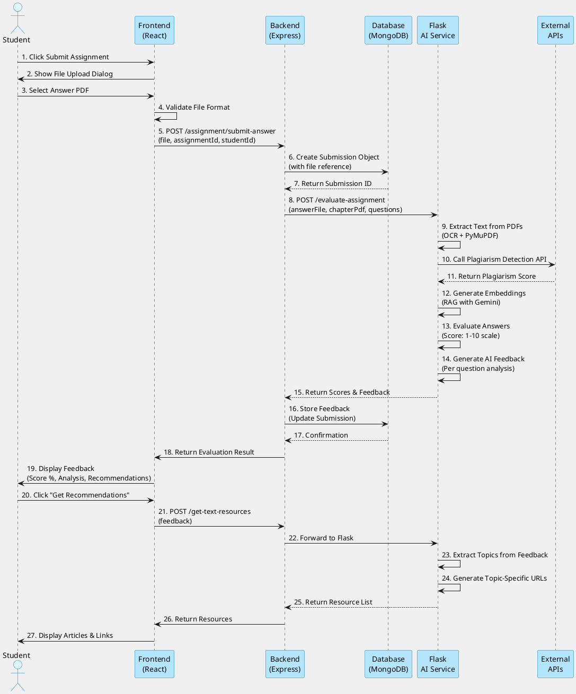

---

### **2.4 SEQUENCE DIAGRAM - QUIZ CREATION & SUBMISSION**

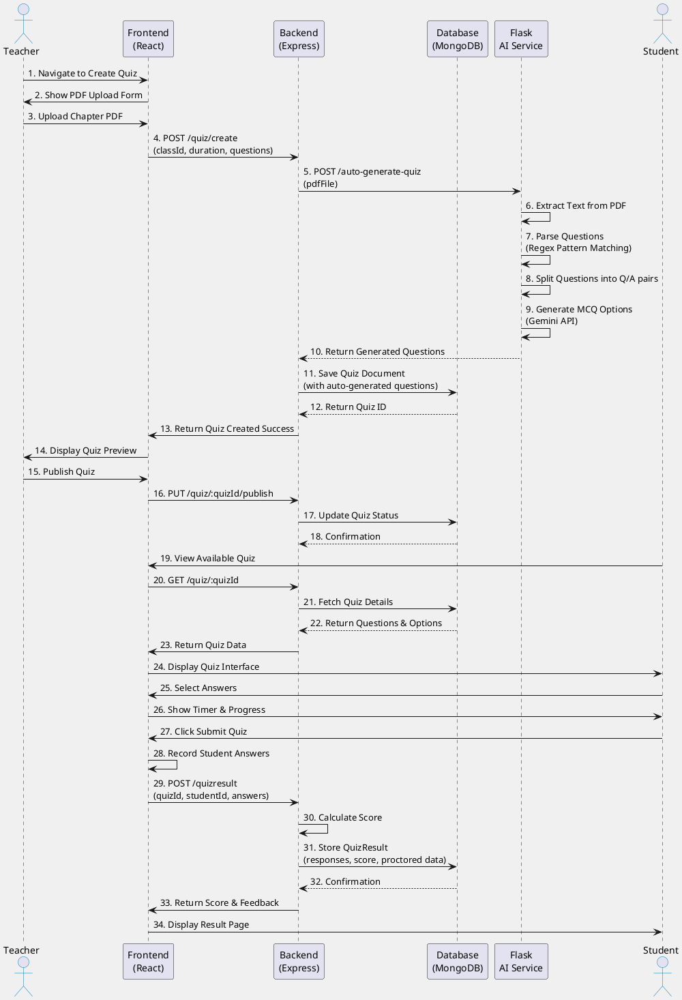

---

### **2.5 SEQUENCE DIAGRAM - VIVA ASSESSMENT WITH AI VOICE**

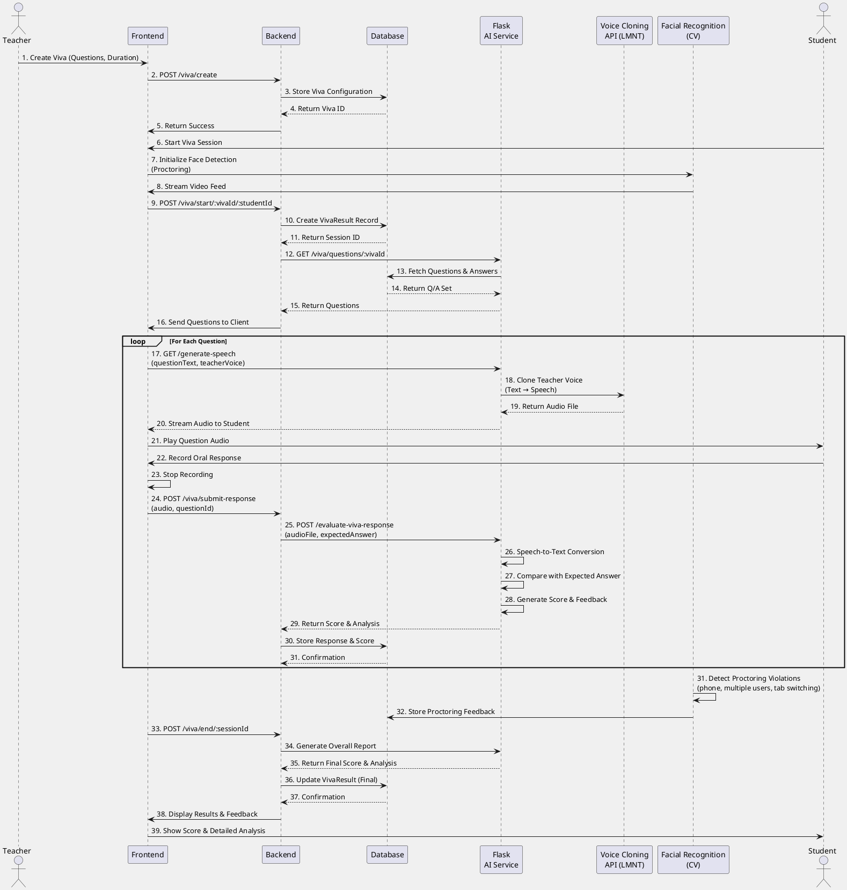

---

### **2.6 SEQUENCE DIAGRAM - COURSE RECOMMENDATION ENGINE**

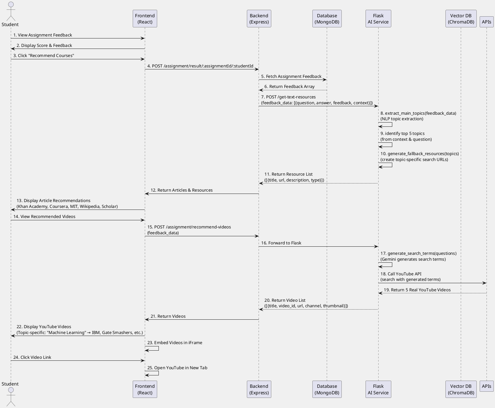

---

### **2.7 ACTIVITY DIAGRAM - ASSIGNMENT EVALUATION WORKFLOW**

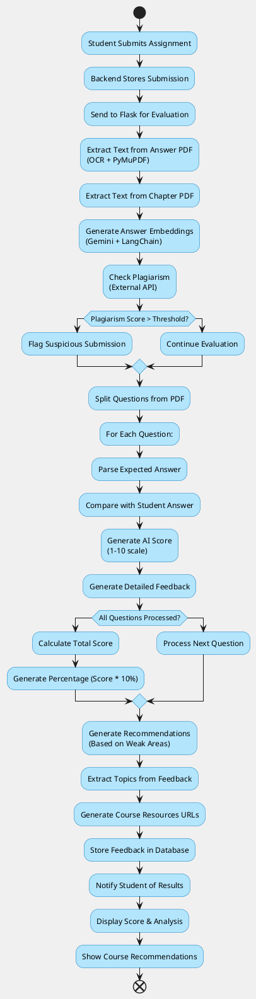

---

### **2.8 ACTIVITY DIAGRAM - TIMETABLE GENERATION (GENETIC ALGORITHM)**

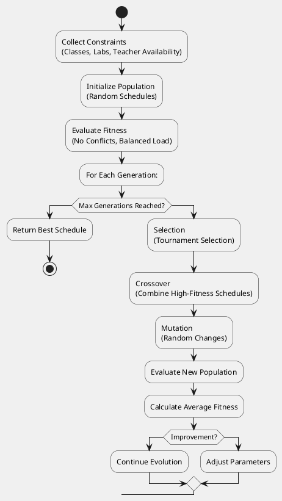

---

### **2.9 STATE MACHINE DIAGRAM - PROJECT COLLABORATION LIFECYCLE**

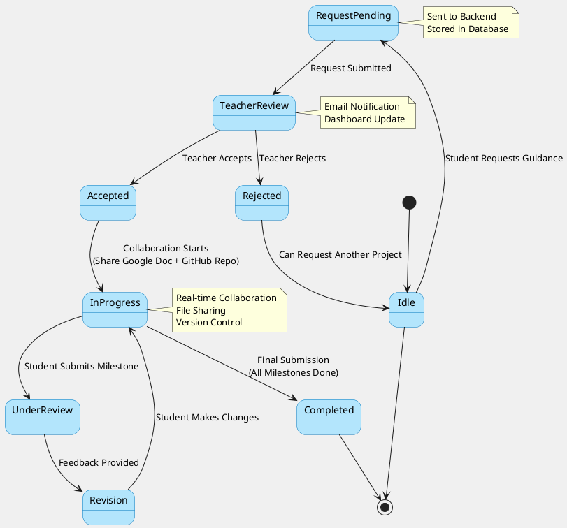

---

### **2.10 COMPONENT DIAGRAM**

This diagram shows the major components and their interdependencies.

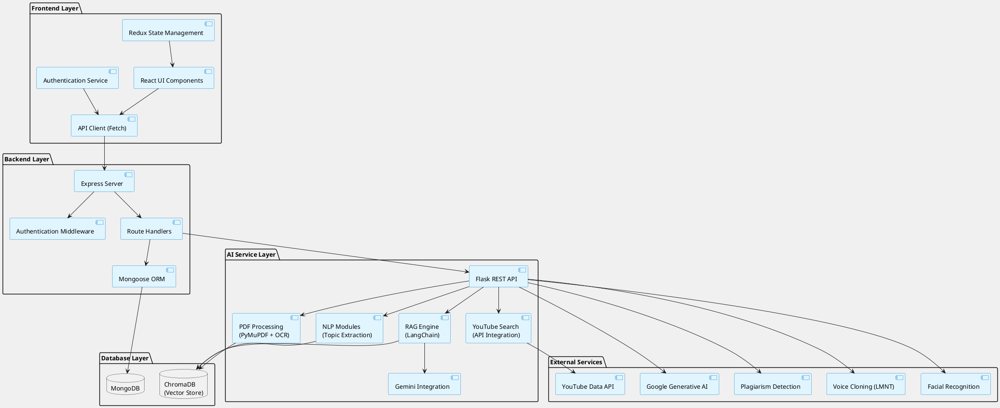

---

### **2.11 DEPLOYMENT DIAGRAM**

```plantuml
@startuml DeploymentDiagram_Distribution
skinparam backgroundColor #f0f0f0
skinparam nodeBackgroundColor #e1f5ff
skinparam nodeBorderColor #0277bd

node "Client Browser" as Client {
    component "React SPA" as ReactApp
    component "WebSocket Client" as WebSocketClient
}

node "Frontend Server\n(Vite Dev/Production)" as FrontendServer {
    artifact "index.html" as FrontendArtifact
}

node "Backend Server\n(Node.js/Express)\nPort: 4000" as BackendServer {
    component "REST API Endpoints" as REST
    component "Socket.io Server" as SocketIO
    component "JWT Auth" as JWTAuth
    component "Mongoose Models" as Models
}

node "AI Service\n(Python/Flask)\nPort: 5000" as AIService {
    component "PDF Processing" as PDF
    component "RAG Pipeline" as RAG
    component "Recommendation Engine" as RecEngine
    component "Video Search Service" as VideoSearch
}

node "MongoDB Database Server" as DBServer {
    database "User Collection" as UserDB
    database "Assignment Collection" as AssignmentDB
    database "Quiz Collection" as QuizDB
    database "Viva Collection" as VivaDB
    database "Project Collection" as ProjectDB
}

node "Vector Database\n(ChromaDB)" as VectorDB {
    database "Vector Embeddings" as Embeddings
}

cloud "External APIs" as Cloud {
    component "Google AI API" as GoogleAPI
    component "YouTube API" as YouTubeAPI
    component "LMNT Voice API" as LMNTAPI
}

' Client to Frontend
Client -.->|HTTP| FrontendServer
Client -.->|WebSocket| BackendServer

' Frontend to Backend
ReactApp -->|REST API| BackendServer
WebSocketClient -->|WebSocket| SocketIO

' Backend components
BackendServer --> REST
BackendServer --> SocketIO
BackendServer --> JWTAuth
BackendServer --> Models

' Backend to AI Service
REST -->|HTTP| AIService

' AI Service components
AIService --> PDF
AIService --> RAG
AIService --> RecEngine
AIService --> VideoSearch

' AI to Databases
RAG --> VectorDB
PDF --> VectorDB

' Backend to Databases
Models --> DBServer
DBServer --> UserDB
DBServer --> AssignmentDB
DBServer --> QuizDB
DBServer --> VivaDB
DBServer --> ProjectDB

' AI to External
AIService --> Cloud
Cloud --> GoogleAPI
Cloud --> YouTubeAPI
Cloud --> LMNTAPI

@enduml
```

---

### **2.12 ENTITY-RELATIONSHIP DIAGRAM (ERD)**

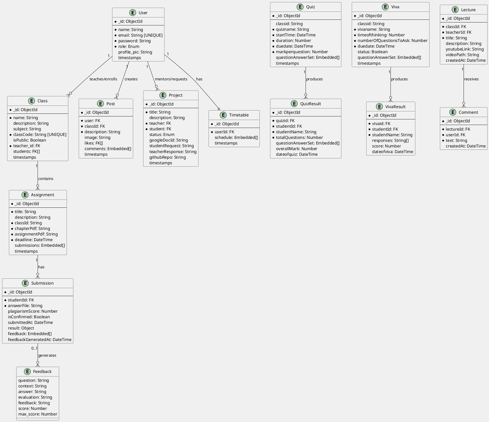

---

### **2.13 DATA FLOW DIAGRAM (DFD) - LEVEL 1**

```plantuml
@startuml DFD_Level1
skinparam backgroundColor #f0f0f0

rectangle "External Systems" as External {
    :YouTube API:
    :Google AI API:
    :Plagiarism API:
    :Voice Cloning API:
}

rectangle "Users" as Users {
    :Teachers:
    :Students:
}

circle "Kaizen ERP\nSystem" as System

rectangle "Databases" as Databases {
    :(MongoDB):
    :(ChromaDB):
}

Users -->|Authentication\nClass/Assignment Data| System
System -->|Learning Content\nResults & Feedback| Users
System -->|Search Queries\nEvaluation Requests| External
External -->|Recommendations\nVoice Data\nScores| System
System -->|Query/Store Data| Databases
Databases -->|Return Data| System

@enduml
```

---

### **2.14 SEQUENCE DIAGRAM - REAL-TIME COLLABORATION ON PROJECTS**

```plantuml
@startuml SequenceDiagram_ProjectCollab
skinparam backgroundColor #f0f0f0

actor Student
participant "Frontend" as FE
participant "Backend" as BE
participant "Database" as DB
participant "Google Docs\nAPI" as GoogleDocs
participant "GitHub API" as GitHub

Student -> FE: 1. Request Guidance
FE -> BE: 2. POST /project/request
BE -> DB: 3. Create Project (status: requested)
DB --> BE: 4. Return Project ID
BE -> FE: 5. Show Status
FE -> Student: 6. "Waiting for Teacher Response"

actor Teacher
Teacher -> FE: 7. View Request
FE -> BE: 8. GET /project/:projectId
BE -> DB: 9. Fetch Project Details
DB --> BE: 10. Return Project Data
BE -> FE: 11. Display Request
FE -> Teacher: 12. Show Proposal

Teacher -> FE: 13. Click Accept & Create Doc
FE -> BE: 14. POST /project/accept/:projectId
BE -> GoogleDocs: 15. Create Google Doc
GoogleDocs --> BE: 16. Return Doc ID & URL
BE -> DB: 17. Store Google Doc ID
DB --> BE: 18. Confirmation
BE -> GitHub: 19. Create GitHub Repo Link
GitHub --> BE: 20. Return Repo URL
BE -> DB: 21. Update Project (status: accepted)
DB --> BE: 22. Confirmation
BE -> FE: 23. Return Doc & Repo Links
FE -> Teacher: 24. Display Collaboration Space

loop Real-time Collaboration
    Teacher -> GoogleDocs: 25. Edit Document
    GoogleDocs -->|Change Notification| FE: 26. Notify Student
    FE -> Student: 27. Show Updates Live
    
    Student -> GoogleDocs: 28. Add Comments/Changes
    GoogleDocs -->|Notification| FE: 29. Notify Teacher
    FE -> Teacher: 30. Show Updates
end

Teacher -> FE: 31. Review Work & Provide Feedback
FE -> BE: 32. POST /project/feedback
BE -> DB: 33. Store Feedback
DB --> BE: 34. Confirmation
BE -> FE: 35. Return Confirmation
FE -> Teacher: 36. Feedback Saved

Student -> FE: 37. View Feedback
FE -> BE: 38. GET /project/:projectId
BE -> DB: 39. Fetch Feedback
DB --> BE: 40. Return Feedback
BE -> FE: 41. Display Feedback
FE -> Student: 42. Show Teacher Comments

@enduml
```

---

## 🔑 PART 3: KEY ARCHITECTURAL PATTERNS & DECISIONS

### **3.1 Authentication & Authorization**
- **Pattern**: JWT Token-based Authentication
- **Flow**: Login → Generate JWT → Store in Cookie → Validate on Each Request
- **Middleware**: `authMiddleware.js` validates token and extracts user info
- **Roles**: Teacher, Student (enforced via role-based middleware)

### **3.2 File Upload & Processing**
- **Pattern**: Multer middleware for multipart/form-data
- **Flow**: Upload → Validate → Store in `/uploads` → Reference in DB
- **Handlers**: `upload.js` middleware + `fileUpload.js` utilities
- **Security**: File type validation, size limits

### **3.3 Error Handling**
- **Pattern**: Try-catch async wrapper
- **Middleware**: `asyncHandler.js` wraps async route handlers
- **Response Format**: `{ message, error, status }`

### **3.4 Database Relationships**
- **Pattern**: Mongoose references (ObjectId foreign keys)
- **Embedding**: Comments & Feedback embedded in parent documents
- **Indexing**: Indexed on frequently queried fields (lectureId, studentId)

### **3.5 AI/ML Integration**
- **Pattern**: Microservice (Flask) with REST endpoints
- **Lazy Loading**: Models initialized on-demand to avoid startup overhead
- **RAG Pipeline**: LangChain + ChromaDB for semantic retrieval
- **Topic Extraction**: NLP with stop word filtering & bigram analysis

### **3.6 Real-Time Communication**
- **Pattern**: WebSocket with Socket.io
- **Events**: Notifications, live updates, chat messages
- **Server**: Integrated into Express via Socket.io middleware

### **3.7 API Design**
- **Style**: RESTful with resource-based naming
- **Versioning**: Not implemented (single version)
- **Pagination**: Can be added for large datasets
- **Filtering**: Query parameters for optional filters

---

## 📈 PART 4: API ENDPOINTS MAPPING

### **User Management**
```
POST   /user/register              - Register new user
POST   /user/login                 - User login
GET    /user/details               - Get logged-in user details
PUT    /user/update                - Update user profile
POST   /user/checkEmail            - Verify email exists
POST   /user/logout                - User logout
POST   /user/search                - Search users
```

### **Class Management**
```
POST   /class/create               - Create new class
GET    /class/all                  - Get all classes
GET    /class/:classId             - Get class details
POST   /class/join                 - Join class
PUT    /class/:classId             - Update class
DELETE /class/:classId             - Delete class
```

### **Assignment Management**
```
POST   /assignment/upload          - Create assignment with PDFs
GET    /assignment/class/:classId  - Get assignments by class
POST   /assignment/submit-answer   - Student submits assignment
GET    /assignment/submissions/:id - Get submissions for assignment
PUT    /assignment/:id/result      - Update submission result
GET    /assignment/result/:id/:sid - Get student's assignment result
POST   /assignment/store-feedback  - Store AI feedback
GET    /assignment/feedback/:id/:sid - Get feedback
```

### **Quiz Management**
```
POST   /quiz/create                - Create quiz (auto-generate questions)
GET    /quiz/:classId              - Get quizzes by class
GET    /quiz/:quizId               - Get quiz details
PUT    /quiz/:quizId               - Update quiz
DELETE /quiz/:quizId               - Delete quiz
POST   /quizresult/add             - Submit quiz result
GET    /quizresult/student/:id     - Get student's quiz results
```

### **Viva Management**
```
POST   /viva/create                - Create viva
GET    /viva/:classId              - Get vivasfor class
GET    /viva/:vivaId               - Get viva details
PUT    /viva/:vivaId               - Update viva
DELETE /viva/:vivaId               - Delete viva
POST   /vivaresult/add             - Submit viva result
GET    /vivaresult/student/:id     - Get student's viva results
```

### **Lecture Management**
```
POST   /lecture/upload             - Upload lecture
GET    /lecture/class/:classId     - Get lectures by class
GET    /lecture/:lectureId         - Get lecture details
DELETE /lecture/:lectureId         - Delete lecture
```

### **Discussion & Comments**
```
POST   /comment/create             - Create comment on lecture
GET    /comment/lecture/:lectureId - Get comments for lecture
PUT    /comment/:commentId         - Update comment
DELETE /comment/:commentId         - Delete comment
```

### **Posts & Forum**
```
POST   /post/create                - Create discussion post
GET    /post/class/:classId        - Get posts for class
POST   /post/:postId/like          - Like post
POST   /post/:postId/comment       - Comment on post
```

### **Project Management**
```
GET    /api/projects/teachers      - Get all teachers
POST   /api/projects/request       - Request guidance
GET    /api/projects/student/:id   - Get student's projects
GET    /api/projects/teacher/:id   - Get teacher's project requests
PUT    /api/projects/:id/respond   - Respond to project request
```

### **Timetable Management**
```
POST   /timetable/save             - Save timetable
GET    /timetable/user/:userId     - Get user's timetable
PUT    /timetable/update           - Update schedule
DELETE /timetable/user/:userId     - Delete timetable
```

### **AI Services (Flask Endpoints)**
```
POST   /evaluate-assignment        - Evaluate assignment answer
POST   /auto-generate-quiz         - Auto-generate quiz from PDF
POST   /get-text-resources         - Get course recommendations (articles)
POST   /recommend-videos           - Get video recommendations (YouTube)
POST   /generate-speech            - Generate voice-cloned question audio
POST   /evaluate-viva-response     - Evaluate viva response
```

---

## 🎯 PART 5: FUNCTIONAL REQUIREMENTS SUMMARY

### **F1: User Management**
- [x] Register with email and password
- [x] Login with JWT authentication
- [x] Role-based access (Teacher/Student)
- [x] Update user profile
- [x] Search for users

### **F2: Classroom Management**
- [x] Teachers create public/private classes
- [x] Unique class code generation
- [x] Students join using class code or public link
- [x] View class members
- [x] Class archiving/deletion

### **F3: Assignment Workflow**
- [x] Create assignments with chapter & assignment PDFs
- [x] Set submission deadlines
- [x] Students submit answer PDFs
- [x] Plagiarism detection
- [x] AI-powered evaluation (1-10 scale)
- [x] Automatic feedback generation
- [x] Course resource recommendations

### **F4: Quiz Management**
- [x] Auto-generate questions from chapter PDFs
- [x] Multiple-choice question support
- [x] Set quiz duration & deadlines
- [x] Students take timed quizzes
- [x] Automatic scoring
- [x] Proctoring via facial recognition

### **F5: Viva (Oral Exam)**
- [x] Create viva with Q&A pairs
- [x] Voice-cloned question delivery
- [x] Student audio response recording
- [x] Speech-to-text evaluation
- [x] AI scoring based on answer quality
- [x] Proctoring violations detection

### **F6: Learning Recommendations**
- [x] Topic extraction from feedback
- [x] Generate article recommendations (Khan Academy, Coursera, MIT)
- [x] YouTube video search with relevant topics
- [x] Topic-specific learning paths

### **F7: Timetable Management**
- [x] Genetic algorithm-based schedule generation
- [x] Automatic conflict resolution
- [x] Student view of personal schedule
- [x] Teacher view of class schedule

### **F8: Project Collaboration**
- [x] Request mentorship/guidance
- [x] Google Docs integration for shared documentation
- [x] GitHub repo integration
- [x] Real-time collaboration
- [x] Mentor feedback system
- [x] Project status tracking

### **F9: Discussion & Social Features**
- [x] Forum posts in classes
- [x] Comment threads on lectures
- [x] Like/unlike posts
- [x] Real-time notifications

### **F10: Analytics & Dashboards**
- [x] Student performance tracking
- [x] Assignment scores & trends
- [x] Quiz/Viva results visualization
- [x] Learning progress metrics

---

## 🏗️ PART 6: NON-FUNCTIONAL REQUIREMENTS

### **Performance**
- Response time < 2s for API calls
- Concurrent user support: 1000+
- PDF processing: < 10s for 50-page PDFs
- Video search: < 3s for YouTube query

### **Security**
- JWT token expiration: 24 hours
- Password hashing: bcryptjs
- CORS policy enforcement
- Input validation & sanitization
- SQL injection prevention (using Mongoose ODM)

### **Scalability**
- Horizontal scaling via load balancing
- Database indexing for query optimization
- Caching for frequently accessed data
- Microservice architecture (Flask separation)

### **Availability**
- 99.5% uptime target
- Database replication
- Error logging & monitoring
- Graceful degradation on API failures

### **Maintainability**
- Clear code structure (MVC pattern)
- Documentation for all endpoints
- Modular component design
- Version control with Git

---

## 📚 PART 7: TECHNOLOGY STACK SUMMARY

| Layer | Technology | Purpose |
|-------|-----------|---------|
| **Frontend** | React 18, Vite | UI Development & Bundling |
| **Frontend Styling** | Tailwind CSS | Responsive Design |
| **State Management** | Redux | Global State |
| **UI Components** | Material-UI | Pre-built Components |
| **Backend** | Express.js | REST API Server |
| **Authentication** | JWT, bcryptjs | Security |
| **Database** | MongoDB, Mongoose | Data Persistence |
| **Vector DB** | ChromaDB | Semantic Search |
| **Real-time** | Socket.io | WebSocket Communication |
| **AI/ML** | Python 3.x, Flask | AI Service |
| **NLP** | LangChain, NLTK | Text Processing |
| **LLM** | Google Generative AI (Gemini) | Content Generation |
| **PDF Processing** | PyMuPDF, pdf2image, pytesseract | Document Processing |
| **External APIs** | YouTube, Plagiarism, Voice Cloning | Third-party Services |
| **Deployment** | Node.js, Python, MongoDB | Runtime Environments |

---

## 🔗 PART 8: INTEGRATION POINTS

### **Frontend ↔ Backend**
- REST API calls via Fetch/Axios
- WebSocket for real-time updates
- JWT token management
- CORS-enabled communication

### **Backend ↔ Flask AI Service**
- HTTP POST requests with JSON payload
- PDF file handling via multipart/form-data
- Async processing for long-running tasks
- Response caching where applicable

### **Backend ↔ External APIs**
- Google AI (Gemini) for content generation
- YouTube Data API for video search
- Plagiarism detection services
- Voice cloning API (LMNT)
- Facial recognition (OpenCV)

### **Database Integration**
- Mongoose for MongoDB operations
- Vector embeddings stored in ChromaDB
- Indexed queries for performance
- Transactions for multi-step operations

---

## 📊 PART 9: DATA SCHEMAS SUMMARY

### **User Schema**
```javascript
{
  name: String,
  email: String (unique),
  password: String (hashed),
  role: 'teacher' | 'student',
  profile_pic: String,
  timestamps
}
```

### **Assignment Submission Schema**
```javascript
{
  studentId: ObjectId,
  answerFile: String,
  plagiarismScore: Number,
  result: { total_score: Number },
  feedback: [{
    question: String,
    answer: String,
    evaluation: String,
    feedback: String,
    score: Number,
    max_score: Number
  }],
  feedbackGeneratedAt: DateTime
}
```

### **Resource Recommendation Schema**
```javascript
{
  title: String,
  description: String,
  url: String,
  type: 'article' | 'paper' | 'video',
  topicArea: String
}
```

---

## ✅ CONCLUSION

This comprehensive UML documentation provides:
- **Use Case Diagram**: All actors and their interactions
- **Class Diagram**: Complete data model with relationships
- **Sequence Diagrams**: Detailed workflows for major features
- **Activity Diagrams**: Process flows for complex operations
- **State Machine Diagram**: Project lifecycle states
- **Component Diagram**: System architecture and dependencies
- **Deployment Diagram**: Infrastructure and service distribution
- **ERD**: Database schema and relationships
- **DFD**: High-level data flows
- **API Mapping**: All endpoints and their purposes

This documentation serves as the blueprint for implementation, testing, and maintenance of the Kaizen HackXplore ERP system.

---

**Generated**: December 2, 2025  
**Version**: 1.0  
**System**: Kaizen HackXplore AI-Driven College ERP  
**Author**: Software Architecture Analysis

